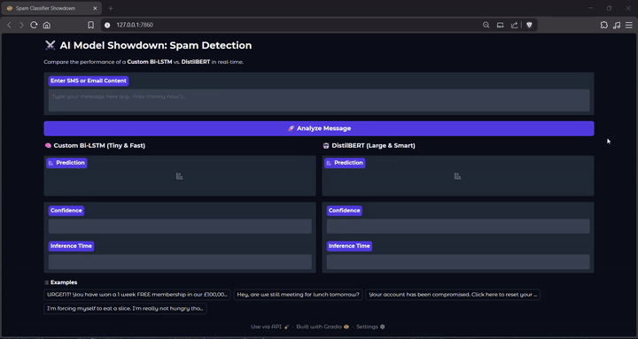

## Attention Spam/Ham

Spam and ham detection for SMS/email text using a custom Bi-LSTM with self-attention and a DistilBERT baseline. The project includes training and inference pipelines, a Gradio demo to compare both models side by side, and scripts to benchmark accuracy/latency.

# Demo Video

Below is a demo of the project in action:



### Highlights
- Two model paths: Bi-LSTM + self-attention vs. DistilBERT sequence classifier.
- Clean text preprocessing tailored to spam signals (URLs, emails, currency, repetition).
- FastText-based embedding matrix for the Bi-LSTM pipeline.
- Gradio app to compare predictions, confidence, and inference time.
- Benchmark scripts for speed and accuracy comparisons.

### Project Layout
- app.py: Gradio UI for real-time model comparison.
- pipeline/inference_pipeline.py: Model loading and prediction logic.
- pipeline/training_pipeline.py: End-to-end Bi-LSTM training pipeline.
- src/: Core model and preprocessing utilities.
 artifacts.
- benchmark/: Model efficiency benchmark script.
- Notebook/: Experiment notebooks.

### Requirements
- Python 3.12
- Dependencies are listed in pyproject.toml.

### Setup

Using uv:
```bash
uv sync
```

Using pip:
```bash
python -m venv .venv
source .venv/bin/activate
pip install -r <(python - <<'PY'
import tomllib
with open('pyproject.toml','rb') as f:
	data = tomllib.load(f)
deps = data['project']['dependencies']
print('\n'.join(deps))
PY
)
```

### Data
The model has been trained from The UCiMLR SMSSpamCollection Dataset.

Almeida, T. & Hidalgo, J. (2011). SMS Spam Collection [Dataset]. UCI Machine Learning Repository. https://doi.org/10.24432/C5CC84.

The project expects the SMS Spam Collection dataset at:
- Data/SMSSpamCollection

Pretrained assets used by the app and benchmarks:
- Data/Spam_Classifier.pth (Bi-LSTM weights)
- Data/vocab.json (custom vocabulary)
- Data/spam_classifier_model/ (DistilBERT artifacts)

Download pretrained models from:
- https://huggingface.co/Mlboy23/Attention_LSTM

### Train the Bi-LSTM + Attention Model
```bash
python pipeline/training_pipeline.py
```

This script:
- Cleans and splits the dataset.
- Builds the vocabulary and FastText embedding matrix.
- Trains the Bi-LSTM with attention.
- Saves the model to Data/Spam_Classifier.pth and vocab to Data/vocab.json.

### Run the Gradio App
```bash
python app.py
```

Open the local URL printed in the terminal to compare:
- Prediction label (SPAM/HAM)
- Confidence
- Inference time

### Benchmarks
Accuracy and latency benchmark:
```bash
python benchmark/benchmark.py
```


### Notebooks
Exploration and model experiments are available in:
- Notebook/Attention.ipynb
- Notebook/BiLSTM.ipynb
- Notebook/DistilBert.ipynb
- Notebook/Fast_Text.ipynb

### Notes
- The Bi-LSTM pipeline expects a FastText model at Data/spam_fasttext_gensim.model.
- DistilBERT artifacts are loaded from Data/spam_classifier_model; if missing, the base model is used.
- For Hugging Face Spaces deployment, Git LFS is required for files larger than 10MB.
